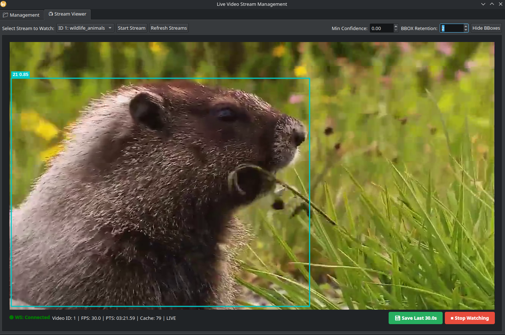
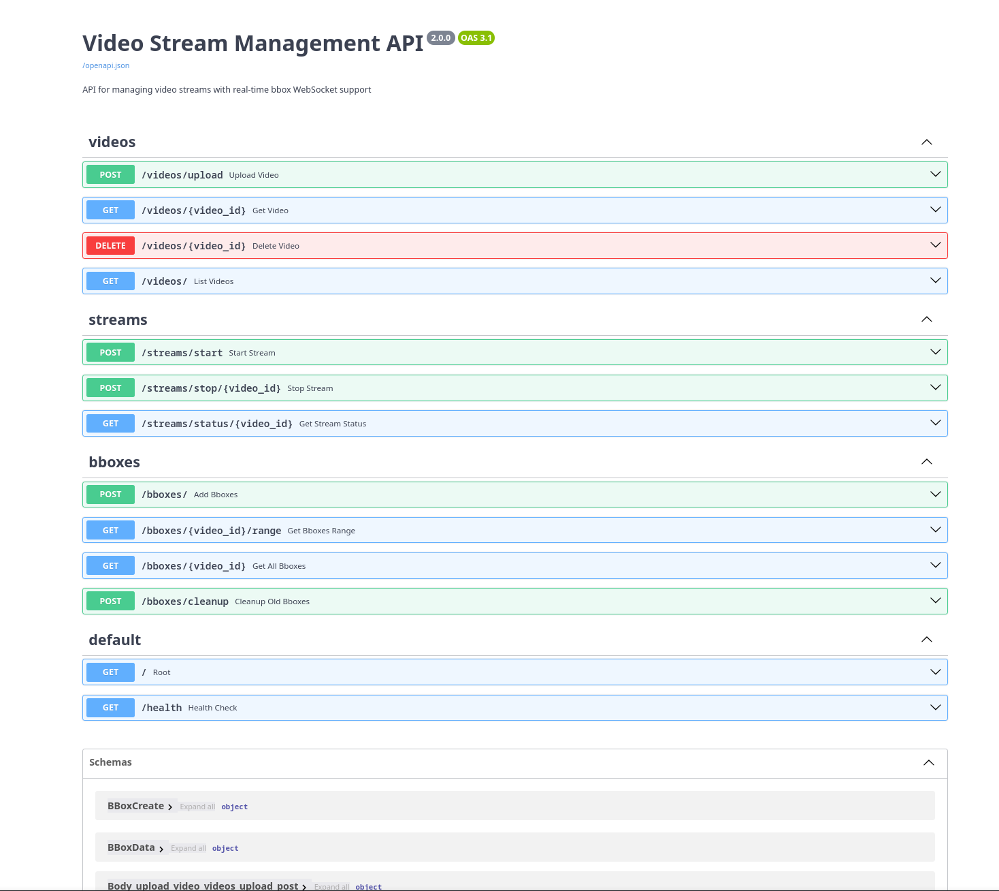

# Real Time Object Detection
The following repository is a collection of research & production grade scripts allowing you to deploy a real-time object detection inference client using various methods.
The main goal was to research methods on deploying this kind of system at large scale, leveraging hardware to its limit, while building lightweight and fast software.

**View for end users**: 

## Triton Server Client
The [`client-triton`](client-triton) folder includes a real time object detection inference system based on **NVIDIA's Triton Server**. 
The entire processing is done in a dedicated application written in **Rust**, to minimize overhead when doing inference at large scale. 
The following architecture takes place: 

Refer to the [`client-triton/README.md`](client-triton/README.md) for more details.

## Video Streamer
The [`video-streamer`](video-streamer) folder includes a backend, user interface and external dynamic library(.so) to stream/display video streams with low latency, including AI analytics results sent by various sources. 

**Video streamer Server**: 

Refer to the [`video-streamer/README.md`](video-streamer/README.md) for more details.

## Model Optimization
The [`model-optimization`](model-optimization) folder includes scripts and instructions to convert a raw PyTorch model to a highly optimized TensorRT engine, ready to be deployed on Triton Server for maximum performance. 
Please refer to the [`model-optimization/README.md`](model-optimization/README.md) for more details.
