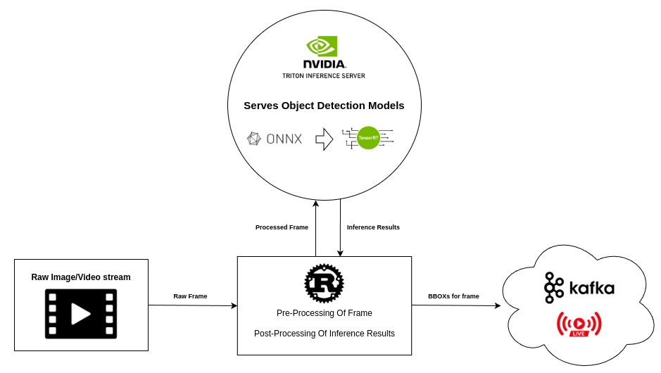

# Real Time Object Detection
The following repository is a collection of research & production grade scripts allowing you to deploy a real-time object detection inference client using various methods.
The main goal was to research methods on deploying this kind of system at large scale, leveraging hardware to its limit, while building lightweight and fast software.

## Triton Server Client
The [`client-triton`](client-triton) folder includes a client implementation based on **NVIDIA's Triton Server**. 
The entire processing is done in a dedicated client written in **Rust**, to minimize overhead when doing inference at large scale. 
The following architecture takes place: 

Refer to the [`client-triton/README.md`](client-triton/README.md) for more details.

## Model Optimization
The [`model_optimization`](model_optimization) folder includes scripts and instructions to convert a raw PyTorch model to a highly optimized TensorRT engine, ready to be deployed on Triton Server for maximum performance. 
Please refer to the [`model_optimization/README.md`](model_optimization/README.md) for more details.

## Video player
The [`video-player`](video-player) folder includes a backend, user interface and external dynamic library(.so) to play video streams with low latency, and send back AI analytics results. 
Refer to the [`video-player/README.md`](video-player/README.md) for more details.