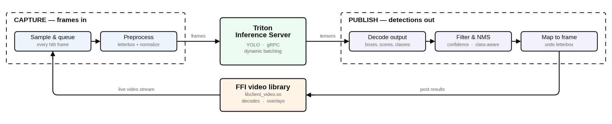

# Client Object Detection
The following project allows consuming a large scale of video sources, ingesting the raw frames using an object detection model (Currently supporting YOLO9, YOLO26), in order to output BBOX results and display them to user in real time (sub-33ms, depending on machine's hardware). The program performs the processing with near-zero overhead, leveraging very possible processing optimization and language parallelism (Rust's Tokio crate, Semaphore) to get the highest throughput possible on a given hardware.

Get started by running the following command:
```bash
moon run client-detection:(gpu/cpu)
```

## Overview
The following diagram emphesizes the architecture of the project, from the moment a video frame is recieved, throughout its whole lifecycle<br>


## Technical details
* This project leverages **NVIDIA's TritonServer** tool, leveraging high throughput when doing inference on GPUs with dynamic batching, alongside **Rust's** native multithreading nature to squeeze performance
