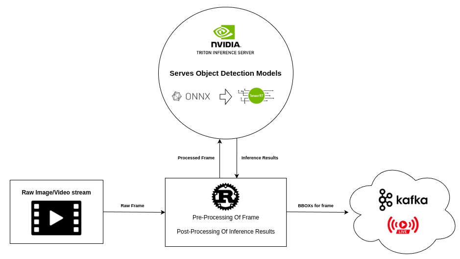

# NVIDIA Triton Server Client
A complete implementation of a production grade system built for the purpose of real time object detection.<br>
The system receives raw video frames, and performs inference using **NVIDIA's Triton Server** efficiently, using a client written in **Rust**.<br>
The following architecture takes place:<br>



## Implementation
In order to implement the following system, it is recommanded to follow the following steps by their order, to squeeze the best performance possible.

## Model Conversion
This step involves converting the raw `.pt` frame you got(whether its self made or pre-made - e.g. YOLOV9), to a format that is the most performant in a production system. We essentially want to get the fastest inference time, with minimal accuracy loss.

We first need to convert our model from `.pt` to ONNX, which is a universal format for machine learning models. We convert the model with the following script:

```
python3.11 scripts/export_yolo_triton.py --model-path <PT_PATH>
```
This will output model_**fp16** and model_**fp32** files, which represent the same model with different datatype formats. <br>
**FP16** Models are essentially equal in accuracy(for inference) and are much lighter and faster to run, and it is recommanded to use. 


Next, we would be converting the `.onnx` file we have to `.engine`, using NVIDIA's TensorRT tool.<br>
TensorRT compiles a model for your specific achitecture(one used at time of compilation), therefore making it very efficient when running on your machine.<br>
We would be doing the TensorRT conversion from within the docker image of Triton Server, to ensure its compatibility with the compiled model.

The following command is used for converting a model (with support of batch inference):
```bash
/usr/src/tensorrt/bin/trtexec \
  --onnx=MODEL.onnx \
  --saveEngine=CONVERTED.engine \
  --optShapes=images:8x3x640x640 \
  --minShapes=images:1x3x640x640 \
  --maxShapes=images:16x3x640x640 \
  --shapes=images:8x3x640x640 \
  --fp16(Or omit for FP32)
```

Image used at the time of writing: `nvcr.io/nvidia/tritonserver:23.08-py3`, although the latest version of Triton Server will do just fine.

## References
* [Triton Dynamic Batching(Nvidia)](https://docs.nvidia.com/deeplearning/triton-inference-server/user-guide/docs/tutorials/Conceptual_Guide/Part_2-improving_resource_utilization/README.html#what-is-dynamic-batching)
* [Triton Inference Protocols](https://docs.nvidia.com/deeplearning/triton-inference-server/user-guide/docs/customization_guide/inference_protocols.html)

## Extras - Get model best latency/throughput
Using a third party tool, `perf_analyzer`, we iterate over different batch sizes for one model instance. We find the sweet spot of when the model is giving the best latency for the max amount of batch size.
```bash
for b in 1 2 4 8 16 32; do
  perf_analyzer \
    -m <model_name> \
    -b $b \
    --concurrency-range 1:1 \
    --collect-metrics \
    --verbose-csv \
    -f results_batch_${b}.csv
done
```

To test performance of TRT model, use the following command:
```bash
/usr/src/tensorrt/bin/trtexec \
  --loadEngine=CONVERTED.engine \
  --shapes=images:8x3x640x640 \
  --exportTimes=inference_times.json
```