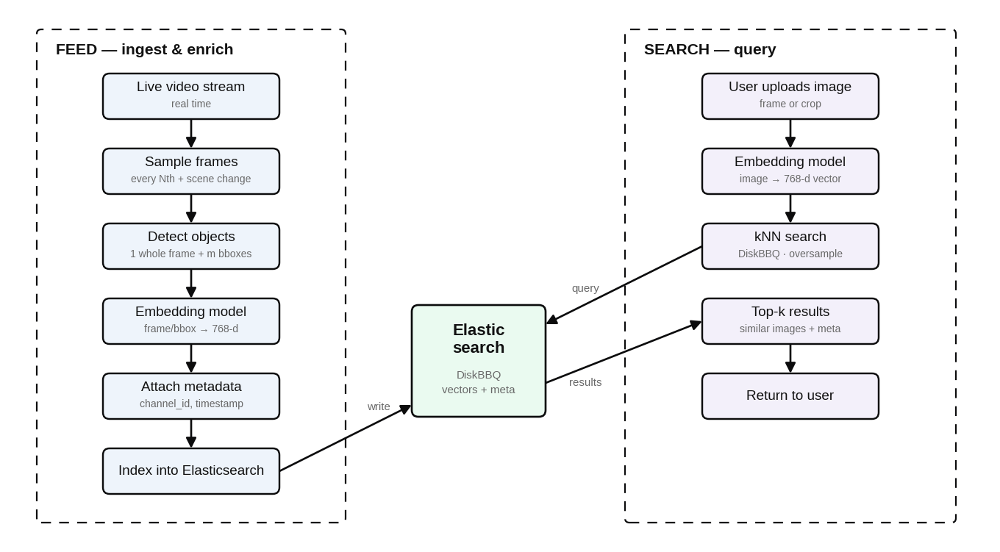

# Image Retrieval Search
The following project exposes an API interface, allowing users to upload custom images (which are then passed through an embedding model - currently supporting **DINOv3**) and **perform search** on a pool of previously indexed video frames, matching the images to similar candidates using KNN search, as part of **ElasticSearch**'s vector DB functionality.

## Architecture overview
The following diagram emphesizes the architecture of the whole Image Retrieval chain. 
This project is the `SEARCH` part of this chain: 

## Technical details
* This project leverages **NVIDIA's TritonServer** tool, leveraging high throughput when doing inference on GPUs with dynamic batching, alongside **Rust's** native multithreading nature to squeeze performance
* ElasticSearch indexes are configured with the **disk_bbq** setting, to allow searching upon large quantities of vectors and not bloating the RAM during the process (vectors are stored on disk, KNN search stores only clusters in RAM and references vectors on disk for search). Refer to [ElasticSearch Setup overview](../elasticsearch-setup.md) for more details
* We deliberately don't use old fashioned Database for this project - due to constraints of latency and to allow higher throughput. Redis is used in order to serve as a shared global state. In multi-pod environment(i.e Kubernetes) pods will need to share a global state between pods to have a single source-of-truth, and to allow more complex logic in the future (i.e. rate-limiting globally)
