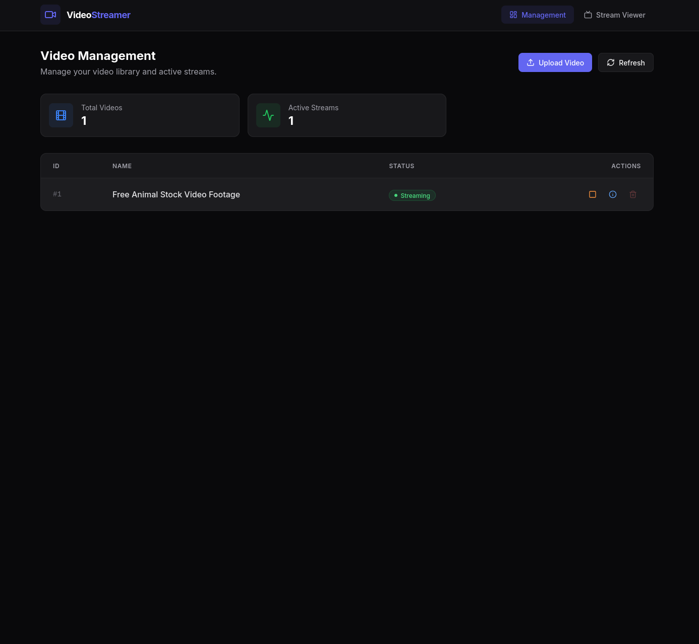
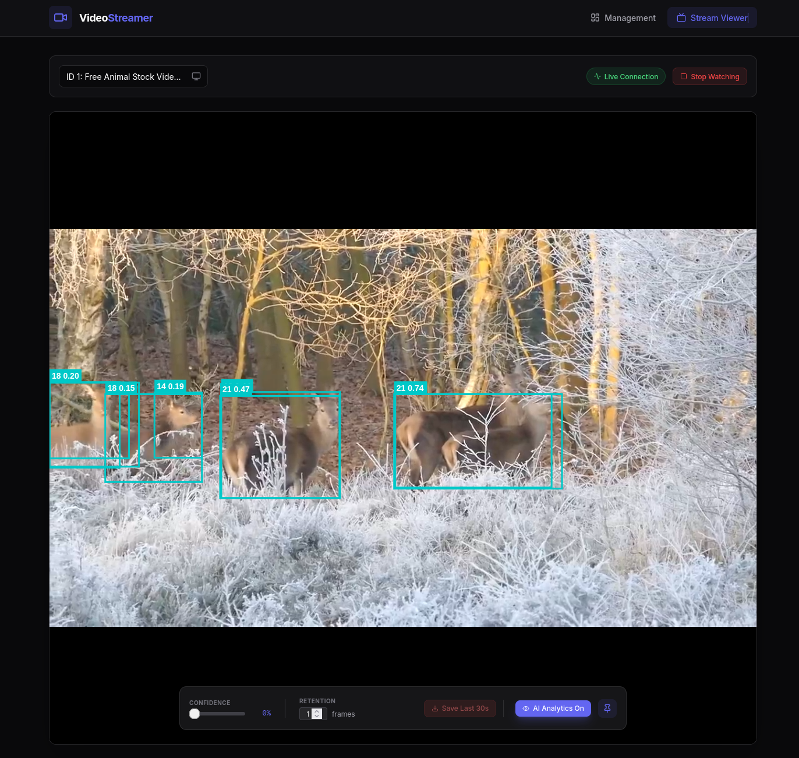

# Video Streamer
The following folder contains an implementation of a video streaming/playing application.<br>
The application allows a user to stream video files from a server to a client over a network connection, and play them in real-time.

## Architecture
The application is divided into three main components:
1. **Backend**: Responsible for reading video files from disk, encoding them into a suitable format for streaming, and sending the encoded video data over a network connection to the client. The server uses **FFmpeg** to stream the video files.

2. **Frontend**: A web user interface that allows users to select video files to stream, control playback (play, pause, stop), and view the video stream (Including AI Analytics sent in real time). The frontend is build on the following stack:
- **Vite**
- **React**
- **Tailwind CSS**

3. **Library**: A shared library that is distributed to third party application, allowing them to connect to the server and receive live video streams. The library also provides functionality ot send back AI Analytics data to the server in real time, to be displayed to end users. The library is build using **Rust**, with **FFmpeg** for video decoding.

## Getting Started
To get started with the video streaming application, follow these steps:<br>

Install and start backend component:
```
cd backend
pip install -r requirements.txt
uvicorn main:app --reload
```

Install and start frontend component:
```
cd frontend
npm install
npm run dev
```


## Sreenshots
**Frontend**:<br>



**Backend**:<br>
